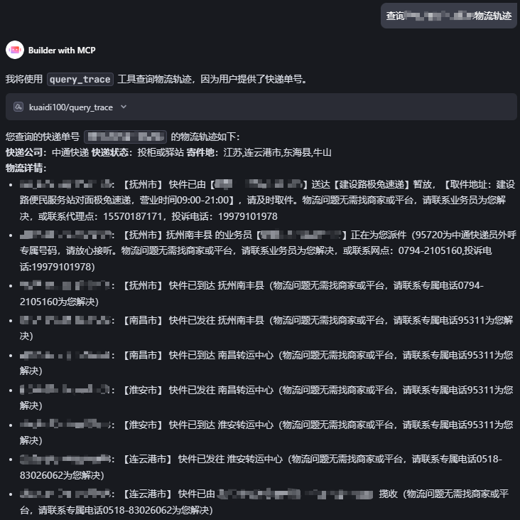
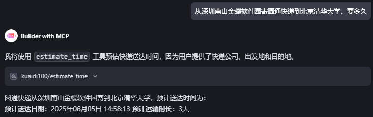
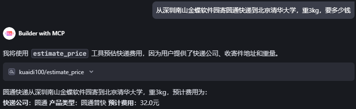

## 快递100 MCP Server (Python)
通过`uv`安装`python`，最低版本要求为3.11

```bash
uv python install 3.11
```

### 配置本地项目
通过`uv`创建一个项目

```bash
uv init mcp_server_kuaidi100
```

将`api_mcp.py`拷贝到该目录下，通过如下命令测试mcp server是否正常运行

```bash
uv run --with mcp[cli] mcp run {YOUR_PATH}/mcp_server_kuaidi100/api_mcp.py
# 如果是mac，需要加转义符
uv run --with mcp\[cli\] mcp run {YOUR_PATH}/mcp_server_kuaidi100/api_mcp.py
```

如果没有报错则MCP Server启动成功

### 获取快递100 API KEY
登录快递100获取 https://poll.kuaidi100.com/manager/page/myinfo/enterprise （注意不要泄露授权key，以防被他人盗用！！！）

### 在支持MCP的客户端中使用
在MCP Server配置文件中添加如下内容后保存

```json
{
  "mcpServers": {
    "kuaidi100": {
      "command": "uv",
      "args": [
        "run",
        "--with",
        "mcp[cli]",
        "mcp",
        "run",
        "{YOUR_PATH}/mcp_server_kuaidi100/api_mcp.py"
      ],
      "env": {
        "KUAIDI100_API_KEY": "<YOUR_API_KEY>"
      }
    }
  }
}
```

### 测试

#### 物流轨迹查询：

#### 快递预估时效：

#### 快递预估价格


### Tips
如需获取账号信息（如 key、customer、secret），或免费试用100单，请访问API开放平台进行注册